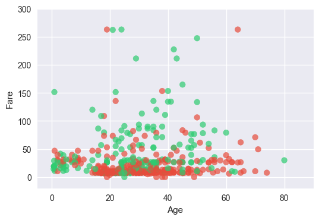

## Titanic Survival Exploration
The sinking of the RMS Titanic is one of the most infamous shipwrecks in history.  On April 15, 1912, during her maiden voyage, the Titanic sank after colliding with an iceberg, killing 1502 out of 2224 passengers and crew. This sensational tragedy shocked the international community and led to better safety regulations for ships.

One of the reasons that the shipwreck led to such loss of life was that there were not enough lifeboats for the passengers and crew. Although there was some element of luck involved in surviving the sinking, some groups of people were more likely to survive than others, such as women, children, and the upper-class.

In this challenge, we ask you to complete the analysis of what sorts of people were likely to survive. In particular, we ask you to apply the tools of machine learning to predict which passengers survived the tragedy.

*Problem Reference* : https://www.kaggle.com/c/titanic

#### Dependencies
* numpy
* pandas
* matplotlib
* scikit-learn
* jupyter notebook


```python
import numpy as np
import pandas as pd
import matplotlib.pyplot as plt
import seaborn as sns
import matplotlib
```


```python
# loading training dataset with labels
df = pd.read_csv("data/train.csv")
df
```


<div>
<style>
    .dataframe thead tr:only-child th {
        text-align: right;
    }

    .dataframe thead th {
        text-align: left;
    }

    .dataframe tbody tr th {
        vertical-align: top;
    }
</style>
<table border="1" class="dataframe">
  <thead>
    <tr style="text-align: right;">
      <th></th>
      <th>PassengerId</th>
      <th>Survived</th>
      <th>Pclass</th>
      <th>Name</th>
      <th>Sex</th>
      <th>Age</th>
      <th>SibSp</th>
      <th>Parch</th>
      <th>Ticket</th>
      <th>Fare</th>
      <th>Cabin</th>
      <th>Embarked</th>
    </tr>
  </thead>
  <tbody>
    <tr>
      <th>0</th>
      <td>1</td>
      <td>0</td>
      <td>3</td>
      <td>Braund, Mr. Owen Harris</td>
      <td>male</td>
      <td>22.0</td>
      <td>1</td>
      <td>0</td>
      <td>A/5 21171</td>
      <td>7.2500</td>
      <td>NaN</td>
      <td>S</td>
    </tr>
    <tr>
      <th>1</th>
      <td>2</td>
      <td>1</td>
      <td>1</td>
      <td>Cumings, Mrs. John Bradley (Florence Briggs Th...</td>
      <td>female</td>
      <td>38.0</td>
      <td>1</td>
      <td>0</td>
      <td>PC 17599</td>
      <td>71.2833</td>
      <td>C85</td>
      <td>C</td>
    </tr>
    <tr>
      <th>2</th>
      <td>3</td>
      <td>1</td>
      <td>3</td>
      <td>Heikkinen, Miss. Laina</td>
      <td>female</td>
      <td>26.0</td>
      <td>0</td>
      <td>0</td>
      <td>STON/O2. 3101282</td>
      <td>7.9250</td>
      <td>NaN</td>
      <td>S</td>
    </tr>
    <tr>
      <th>3</th>
      <td>4</td>
      <td>1</td>
      <td>1</td>
      <td>Futrelle, Mrs. Jacques Heath (Lily May Peel)</td>
      <td>female</td>
      <td>35.0</td>
      <td>1</td>
      <td>0</td>
      <td>113803</td>
      <td>53.1000</td>
      <td>C123</td>
      <td>S</td>
    </tr>
    <tr>
      <th>4</th>
      <td>5</td>
      <td>0</td>
      <td>3</td>
      <td>Allen, Mr. William Henry</td>
      <td>male</td>
      <td>35.0</td>
      <td>0</td>
      <td>0</td>
      <td>373450</td>
      <td>8.0500</td>
      <td>NaN</td>
      <td>S</td>
    </tr>
    <tr>
      <th>5</th>
      <td>6</td>
      <td>0</td>
      <td>3</td>
      <td>Moran, Mr. James</td>
      <td>male</td>
      <td>NaN</td>
      <td>0</td>
      <td>0</td>
      <td>330877</td>
      <td>8.4583</td>
      <td>NaN</td>
      <td>Q</td>
    </tr>
    <tr>
      <th>6</th>
      <td>7</td>
      <td>0</td>
      <td>1</td>
      <td>McCarthy, Mr. Timothy J</td>
      <td>male</td>
      <td>54.0</td>
      <td>0</td>
      <td>0</td>
      <td>17463</td>
      <td>51.8625</td>
      <td>E46</td>
      <td>S</td>
    </tr>
    <tr>
      <th>7</th>
      <td>8</td>
      <td>0</td>
      <td>3</td>
      <td>Palsson, Master. Gosta Leonard</td>
      <td>male</td>
      <td>2.0</td>
      <td>3</td>
      <td>1</td>
      <td>349909</td>
      <td>21.0750</td>
      <td>NaN</td>
      <td>S</td>
    </tr>
    <tr>
      <th>8</th>
      <td>9</td>
      <td>1</td>
      <td>3</td>
      <td>Johnson, Mrs. Oscar W (Elisabeth Vilhelmina Berg)</td>
      <td>female</td>
      <td>27.0</td>
      <td>0</td>
      <td>2</td>
      <td>347742</td>
      <td>11.1333</td>
      <td>NaN</td>
      <td>S</td>
    </tr>
    <tr>
      <th>9</th>
      <td>10</td>
      <td>1</td>
      <td>2</td>
      <td>Nasser, Mrs. Nicholas (Adele Achem)</td>
      <td>female</td>
      <td>14.0</td>
      <td>1</td>
      <td>0</td>
      <td>237736</td>
      <td>30.0708</td>
      <td>NaN</td>
      <td>C</td>
    </tr>
    <tr>
      <th>10</th>
      <td>11</td>
      <td>1</td>
      <td>3</td>
      <td>Sandstrom, Miss. Marguerite Rut</td>
      <td>female</td>
      <td>4.0</td>
      <td>1</td>
      <td>1</td>
      <td>PP 9549</td>
      <td>16.7000</td>
      <td>G6</td>
      <td>S</td>
    </tr>
    <tr>
      <th>11</th>
      <td>12</td>
      <td>1</td>
      <td>1</td>
      <td>Bonnell, Miss. Elizabeth</td>
      <td>female</td>
      <td>58.0</td>
      <td>0</td>
      <td>0</td>
      <td>113783</td>
      <td>26.5500</td>
      <td>C103</td>
      <td>S</td>
    </tr>
    <tr>
      <th>12</th>
      <td>13</td>
      <td>0</td>
      <td>3</td>
      <td>Saundercock, Mr. William Henry</td>
      <td>male</td>
      <td>20.0</td>
      <td>0</td>
      <td>0</td>
      <td>A/5. 2151</td>
      <td>8.0500</td>
      <td>NaN</td>
      <td>S</td>
    </tr>
    <tr>
      <th>13</th>
      <td>14</td>
      <td>0</td>
      <td>3</td>
      <td>Andersson, Mr. Anders Johan</td>
      <td>male</td>
      <td>39.0</td>
      <td>1</td>
      <td>5</td>
      <td>347082</td>
      <td>31.2750</td>
      <td>NaN</td>
      <td>S</td>
    </tr>
    <tr>
      <th>14</th>
      <td>15</td>
      <td>0</td>
      <td>3</td>
      <td>Vestrom, Miss. Hulda Amanda Adolfina</td>
      <td>female</td>
      <td>14.0</td>
      <td>0</td>
      <td>0</td>
      <td>350406</td>
      <td>7.8542</td>
      <td>NaN</td>
      <td>S</td>
    </tr>
    <tr>
      <th>15</th>
      <td>16</td>
      <td>1</td>
      <td>2</td>
      <td>Hewlett, Mrs. (Mary D Kingcome)</td>
      <td>female</td>
      <td>55.0</td>
      <td>0</td>
      <td>0</td>
      <td>248706</td>
      <td>16.0000</td>
      <td>NaN</td>
      <td>S</td>
    </tr>
    <tr>
      <th>16</th>
      <td>17</td>
      <td>0</td>
      <td>3</td>
      <td>Rice, Master. Eugene</td>
      <td>male</td>
      <td>2.0</td>
      <td>4</td>
      <td>1</td>
      <td>382652</td>
      <td>29.1250</td>
      <td>NaN</td>
      <td>Q</td>
    </tr>
    <tr>
      <th>17</th>
      <td>18</td>
      <td>1</td>
      <td>2</td>
      <td>Williams, Mr. Charles Eugene</td>
      <td>male</td>
      <td>NaN</td>
      <td>0</td>
      <td>0</td>
      <td>244373</td>
      <td>13.0000</td>
      <td>NaN</td>
      <td>S</td>
    </tr>
    <tr>
      <th>18</th>
      <td>19</td>
      <td>0</td>
      <td>3</td>
      <td>Vander Planke, Mrs. Julius (Emelia Maria Vande...</td>
      <td>female</td>
      <td>31.0</td>
      <td>1</td>
      <td>0</td>
      <td>345763</td>
      <td>18.0000</td>
      <td>NaN</td>
      <td>S</td>
    </tr>
    <tr>
      <th>19</th>
      <td>20</td>
      <td>1</td>
      <td>3</td>
      <td>Masselmani, Mrs. Fatima</td>
      <td>female</td>
      <td>NaN</td>
      <td>0</td>
      <td>0</td>
      <td>2649</td>
      <td>7.2250</td>
      <td>NaN</td>
      <td>C</td>
    </tr>
    <tr>
      <th>20</th>
      <td>21</td>
      <td>0</td>
      <td>2</td>
      <td>Fynney, Mr. Joseph J</td>
      <td>male</td>
      <td>35.0</td>
      <td>0</td>
      <td>0</td>
      <td>239865</td>
      <td>26.0000</td>
      <td>NaN</td>
      <td>S</td>
    </tr>
    <tr>
      <th>21</th>
      <td>22</td>
      <td>1</td>
      <td>2</td>
      <td>Beesley, Mr. Lawrence</td>
      <td>male</td>
      <td>34.0</td>
      <td>0</td>
      <td>0</td>
      <td>248698</td>
      <td>13.0000</td>
      <td>D56</td>
      <td>S</td>
    </tr>
    <tr>
      <th>22</th>
      <td>23</td>
      <td>1</td>
      <td>3</td>
      <td>McGowan, Miss. Anna "Annie"</td>
      <td>female</td>
      <td>15.0</td>
      <td>0</td>
      <td>0</td>
      <td>330923</td>
      <td>8.0292</td>
      <td>NaN</td>
      <td>Q</td>
    </tr>
    <tr>
      <th>23</th>
      <td>24</td>
      <td>1</td>
      <td>1</td>
      <td>Sloper, Mr. William Thompson</td>
      <td>male</td>
      <td>28.0</td>
      <td>0</td>
      <td>0</td>
      <td>113788</td>
      <td>35.5000</td>
      <td>A6</td>
      <td>S</td>
    </tr>
    <tr>
      <th>24</th>
      <td>25</td>
      <td>0</td>
      <td>3</td>
      <td>Palsson, Miss. Torborg Danira</td>
      <td>female</td>
      <td>8.0</td>
      <td>3</td>
      <td>1</td>
      <td>349909</td>
      <td>21.0750</td>
      <td>NaN</td>
      <td>S</td>
    </tr>
    <tr>
      <th>25</th>
      <td>26</td>
      <td>1</td>
      <td>3</td>
      <td>Asplund, Mrs. Carl Oscar (Selma Augusta Emilia...</td>
      <td>female</td>
      <td>38.0</td>
      <td>1</td>
      <td>5</td>
      <td>347077</td>
      <td>31.3875</td>
      <td>NaN</td>
      <td>S</td>
    </tr>
    <tr>
      <th>26</th>
      <td>27</td>
      <td>0</td>
      <td>3</td>
      <td>Emir, Mr. Farred Chehab</td>
      <td>male</td>
      <td>NaN</td>
      <td>0</td>
      <td>0</td>
      <td>2631</td>
      <td>7.2250</td>
      <td>NaN</td>
      <td>C</td>
    </tr>
    <tr>
      <th>27</th>
      <td>28</td>
      <td>0</td>
      <td>1</td>
      <td>Fortune, Mr. Charles Alexander</td>
      <td>male</td>
      <td>19.0</td>
      <td>3</td>
      <td>2</td>
      <td>19950</td>
      <td>263.0000</td>
      <td>C23 C25 C27</td>
      <td>S</td>
    </tr>
    <tr>
      <th>28</th>
      <td>29</td>
      <td>1</td>
      <td>3</td>
      <td>O'Dwyer, Miss. Ellen "Nellie"</td>
      <td>female</td>
      <td>NaN</td>
      <td>0</td>
      <td>0</td>
      <td>330959</td>
      <td>7.8792</td>
      <td>NaN</td>
      <td>Q</td>
    </tr>
    <tr>
      <th>29</th>
      <td>30</td>
      <td>0</td>
      <td>3</td>
      <td>Todoroff, Mr. Lalio</td>
      <td>male</td>
      <td>NaN</td>
      <td>0</td>
      <td>0</td>
      <td>349216</td>
      <td>7.8958</td>
      <td>NaN</td>
      <td>S</td>
    </tr>
    <tr>
      <th>...</th>
      <td>...</td>
      <td>...</td>
      <td>...</td>
      <td>...</td>
      <td>...</td>
      <td>...</td>
      <td>...</td>
      <td>...</td>
      <td>...</td>
      <td>...</td>
      <td>...</td>
      <td>...</td>
    </tr>
    <tr>
      <th>861</th>
      <td>862</td>
      <td>0</td>
      <td>2</td>
      <td>Giles, Mr. Frederick Edward</td>
      <td>male</td>
      <td>21.0</td>
      <td>1</td>
      <td>0</td>
      <td>28134</td>
      <td>11.5000</td>
      <td>NaN</td>
      <td>S</td>
    </tr>
    <tr>
      <th>862</th>
      <td>863</td>
      <td>1</td>
      <td>1</td>
      <td>Swift, Mrs. Frederick Joel (Margaret Welles Ba...</td>
      <td>female</td>
      <td>48.0</td>
      <td>0</td>
      <td>0</td>
      <td>17466</td>
      <td>25.9292</td>
      <td>D17</td>
      <td>S</td>
    </tr>
    <tr>
      <th>863</th>
      <td>864</td>
      <td>0</td>
      <td>3</td>
      <td>Sage, Miss. Dorothy Edith "Dolly"</td>
      <td>female</td>
      <td>NaN</td>
      <td>8</td>
      <td>2</td>
      <td>CA. 2343</td>
      <td>69.5500</td>
      <td>NaN</td>
      <td>S</td>
    </tr>
    <tr>
      <th>864</th>
      <td>865</td>
      <td>0</td>
      <td>2</td>
      <td>Gill, Mr. John William</td>
      <td>male</td>
      <td>24.0</td>
      <td>0</td>
      <td>0</td>
      <td>233866</td>
      <td>13.0000</td>
      <td>NaN</td>
      <td>S</td>
    </tr>
    <tr>
      <th>865</th>
      <td>866</td>
      <td>1</td>
      <td>2</td>
      <td>Bystrom, Mrs. (Karolina)</td>
      <td>female</td>
      <td>42.0</td>
      <td>0</td>
      <td>0</td>
      <td>236852</td>
      <td>13.0000</td>
      <td>NaN</td>
      <td>S</td>
    </tr>
    <tr>
      <th>866</th>
      <td>867</td>
      <td>1</td>
      <td>2</td>
      <td>Duran y More, Miss. Asuncion</td>
      <td>female</td>
      <td>27.0</td>
      <td>1</td>
      <td>0</td>
      <td>SC/PARIS 2149</td>
      <td>13.8583</td>
      <td>NaN</td>
      <td>C</td>
    </tr>
    <tr>
      <th>867</th>
      <td>868</td>
      <td>0</td>
      <td>1</td>
      <td>Roebling, Mr. Washington Augustus II</td>
      <td>male</td>
      <td>31.0</td>
      <td>0</td>
      <td>0</td>
      <td>PC 17590</td>
      <td>50.4958</td>
      <td>A24</td>
      <td>S</td>
    </tr>
    <tr>
      <th>868</th>
      <td>869</td>
      <td>0</td>
      <td>3</td>
      <td>van Melkebeke, Mr. Philemon</td>
      <td>male</td>
      <td>NaN</td>
      <td>0</td>
      <td>0</td>
      <td>345777</td>
      <td>9.5000</td>
      <td>NaN</td>
      <td>S</td>
    </tr>
    <tr>
      <th>869</th>
      <td>870</td>
      <td>1</td>
      <td>3</td>
      <td>Johnson, Master. Harold Theodor</td>
      <td>male</td>
      <td>4.0</td>
      <td>1</td>
      <td>1</td>
      <td>347742</td>
      <td>11.1333</td>
      <td>NaN</td>
      <td>S</td>
    </tr>
    <tr>
      <th>870</th>
      <td>871</td>
      <td>0</td>
      <td>3</td>
      <td>Balkic, Mr. Cerin</td>
      <td>male</td>
      <td>26.0</td>
      <td>0</td>
      <td>0</td>
      <td>349248</td>
      <td>7.8958</td>
      <td>NaN</td>
      <td>S</td>
    </tr>
    <tr>
      <th>871</th>
      <td>872</td>
      <td>1</td>
      <td>1</td>
      <td>Beckwith, Mrs. Richard Leonard (Sallie Monypeny)</td>
      <td>female</td>
      <td>47.0</td>
      <td>1</td>
      <td>1</td>
      <td>11751</td>
      <td>52.5542</td>
      <td>D35</td>
      <td>S</td>
    </tr>
    <tr>
      <th>872</th>
      <td>873</td>
      <td>0</td>
      <td>1</td>
      <td>Carlsson, Mr. Frans Olof</td>
      <td>male</td>
      <td>33.0</td>
      <td>0</td>
      <td>0</td>
      <td>695</td>
      <td>5.0000</td>
      <td>B51 B53 B55</td>
      <td>S</td>
    </tr>
    <tr>
      <th>873</th>
      <td>874</td>
      <td>0</td>
      <td>3</td>
      <td>Vander Cruyssen, Mr. Victor</td>
      <td>male</td>
      <td>47.0</td>
      <td>0</td>
      <td>0</td>
      <td>345765</td>
      <td>9.0000</td>
      <td>NaN</td>
      <td>S</td>
    </tr>
    <tr>
      <th>874</th>
      <td>875</td>
      <td>1</td>
      <td>2</td>
      <td>Abelson, Mrs. Samuel (Hannah Wizosky)</td>
      <td>female</td>
      <td>28.0</td>
      <td>1</td>
      <td>0</td>
      <td>P/PP 3381</td>
      <td>24.0000</td>
      <td>NaN</td>
      <td>C</td>
    </tr>
    <tr>
      <th>875</th>
      <td>876</td>
      <td>1</td>
      <td>3</td>
      <td>Najib, Miss. Adele Kiamie "Jane"</td>
      <td>female</td>
      <td>15.0</td>
      <td>0</td>
      <td>0</td>
      <td>2667</td>
      <td>7.2250</td>
      <td>NaN</td>
      <td>C</td>
    </tr>
    <tr>
      <th>876</th>
      <td>877</td>
      <td>0</td>
      <td>3</td>
      <td>Gustafsson, Mr. Alfred Ossian</td>
      <td>male</td>
      <td>20.0</td>
      <td>0</td>
      <td>0</td>
      <td>7534</td>
      <td>9.8458</td>
      <td>NaN</td>
      <td>S</td>
    </tr>
    <tr>
      <th>877</th>
      <td>878</td>
      <td>0</td>
      <td>3</td>
      <td>Petroff, Mr. Nedelio</td>
      <td>male</td>
      <td>19.0</td>
      <td>0</td>
      <td>0</td>
      <td>349212</td>
      <td>7.8958</td>
      <td>NaN</td>
      <td>S</td>
    </tr>
    <tr>
      <th>878</th>
      <td>879</td>
      <td>0</td>
      <td>3</td>
      <td>Laleff, Mr. Kristo</td>
      <td>male</td>
      <td>NaN</td>
      <td>0</td>
      <td>0</td>
      <td>349217</td>
      <td>7.8958</td>
      <td>NaN</td>
      <td>S</td>
    </tr>
    <tr>
      <th>879</th>
      <td>880</td>
      <td>1</td>
      <td>1</td>
      <td>Potter, Mrs. Thomas Jr (Lily Alexenia Wilson)</td>
      <td>female</td>
      <td>56.0</td>
      <td>0</td>
      <td>1</td>
      <td>11767</td>
      <td>83.1583</td>
      <td>C50</td>
      <td>C</td>
    </tr>
    <tr>
      <th>880</th>
      <td>881</td>
      <td>1</td>
      <td>2</td>
      <td>Shelley, Mrs. William (Imanita Parrish Hall)</td>
      <td>female</td>
      <td>25.0</td>
      <td>0</td>
      <td>1</td>
      <td>230433</td>
      <td>26.0000</td>
      <td>NaN</td>
      <td>S</td>
    </tr>
    <tr>
      <th>881</th>
      <td>882</td>
      <td>0</td>
      <td>3</td>
      <td>Markun, Mr. Johann</td>
      <td>male</td>
      <td>33.0</td>
      <td>0</td>
      <td>0</td>
      <td>349257</td>
      <td>7.8958</td>
      <td>NaN</td>
      <td>S</td>
    </tr>
    <tr>
      <th>882</th>
      <td>883</td>
      <td>0</td>
      <td>3</td>
      <td>Dahlberg, Miss. Gerda Ulrika</td>
      <td>female</td>
      <td>22.0</td>
      <td>0</td>
      <td>0</td>
      <td>7552</td>
      <td>10.5167</td>
      <td>NaN</td>
      <td>S</td>
    </tr>
    <tr>
      <th>883</th>
      <td>884</td>
      <td>0</td>
      <td>2</td>
      <td>Banfield, Mr. Frederick James</td>
      <td>male</td>
      <td>28.0</td>
      <td>0</td>
      <td>0</td>
      <td>C.A./SOTON 34068</td>
      <td>10.5000</td>
      <td>NaN</td>
      <td>S</td>
    </tr>
    <tr>
      <th>884</th>
      <td>885</td>
      <td>0</td>
      <td>3</td>
      <td>Sutehall, Mr. Henry Jr</td>
      <td>male</td>
      <td>25.0</td>
      <td>0</td>
      <td>0</td>
      <td>SOTON/OQ 392076</td>
      <td>7.0500</td>
      <td>NaN</td>
      <td>S</td>
    </tr>
    <tr>
      <th>885</th>
      <td>886</td>
      <td>0</td>
      <td>3</td>
      <td>Rice, Mrs. William (Margaret Norton)</td>
      <td>female</td>
      <td>39.0</td>
      <td>0</td>
      <td>5</td>
      <td>382652</td>
      <td>29.1250</td>
      <td>NaN</td>
      <td>Q</td>
    </tr>
    <tr>
      <th>886</th>
      <td>887</td>
      <td>0</td>
      <td>2</td>
      <td>Montvila, Rev. Juozas</td>
      <td>male</td>
      <td>27.0</td>
      <td>0</td>
      <td>0</td>
      <td>211536</td>
      <td>13.0000</td>
      <td>NaN</td>
      <td>S</td>
    </tr>
    <tr>
      <th>887</th>
      <td>888</td>
      <td>1</td>
      <td>1</td>
      <td>Graham, Miss. Margaret Edith</td>
      <td>female</td>
      <td>19.0</td>
      <td>0</td>
      <td>0</td>
      <td>112053</td>
      <td>30.0000</td>
      <td>B42</td>
      <td>S</td>
    </tr>
    <tr>
      <th>888</th>
      <td>889</td>
      <td>0</td>
      <td>3</td>
      <td>Johnston, Miss. Catherine Helen "Carrie"</td>
      <td>female</td>
      <td>NaN</td>
      <td>1</td>
      <td>2</td>
      <td>W./C. 6607</td>
      <td>23.4500</td>
      <td>NaN</td>
      <td>S</td>
    </tr>
    <tr>
      <th>889</th>
      <td>890</td>
      <td>1</td>
      <td>1</td>
      <td>Behr, Mr. Karl Howell</td>
      <td>male</td>
      <td>26.0</td>
      <td>0</td>
      <td>0</td>
      <td>111369</td>
      <td>30.0000</td>
      <td>C148</td>
      <td>C</td>
    </tr>
    <tr>
      <th>890</th>
      <td>891</td>
      <td>0</td>
      <td>3</td>
      <td>Dooley, Mr. Patrick</td>
      <td>male</td>
      <td>32.0</td>
      <td>0</td>
      <td>0</td>
      <td>370376</td>
      <td>7.7500</td>
      <td>NaN</td>
      <td>Q</td>
    </tr>
  </tbody>
</table>
<p>891 rows × 12 columns</p>
</div>


```python
#Remove the most incompleted fields 
df_reduced = df.drop(['PassengerId','Name','Ticket','Cabin'],axis=1)
df_clean = df_reduced.dropna()
df_clean
```


<div>
<style>
    .dataframe thead tr:only-child th {
        text-align: right;
    }

    .dataframe thead th {
        text-align: left;
    }

    .dataframe tbody tr th {
        vertical-align: top;
    }
</style>
<table border="1" class="dataframe">
  <thead>
    <tr style="text-align: right;">
      <th></th>
      <th>Survived</th>
      <th>Pclass</th>
      <th>Sex</th>
      <th>Age</th>
      <th>SibSp</th>
      <th>Parch</th>
      <th>Fare</th>
      <th>Embarked</th>
    </tr>
  </thead>
  <tbody>
    <tr>
      <th>0</th>
      <td>0</td>
      <td>3</td>
      <td>male</td>
      <td>22.0</td>
      <td>1</td>
      <td>0</td>
      <td>7.2500</td>
      <td>S</td>
    </tr>
    <tr>
      <th>1</th>
      <td>1</td>
      <td>1</td>
      <td>female</td>
      <td>38.0</td>
      <td>1</td>
      <td>0</td>
      <td>71.2833</td>
      <td>C</td>
    </tr>
    <tr>
      <th>2</th>
      <td>1</td>
      <td>3</td>
      <td>female</td>
      <td>26.0</td>
      <td>0</td>
      <td>0</td>
      <td>7.9250</td>
      <td>S</td>
    </tr>
    <tr>
      <th>3</th>
      <td>1</td>
      <td>1</td>
      <td>female</td>
      <td>35.0</td>
      <td>1</td>
      <td>0</td>
      <td>53.1000</td>
      <td>S</td>
    </tr>
    <tr>
      <th>4</th>
      <td>0</td>
      <td>3</td>
      <td>male</td>
      <td>35.0</td>
      <td>0</td>
      <td>0</td>
      <td>8.0500</td>
      <td>S</td>
    </tr>
    <tr>
      <th>6</th>
      <td>0</td>
      <td>1</td>
      <td>male</td>
      <td>54.0</td>
      <td>0</td>
      <td>0</td>
      <td>51.8625</td>
      <td>S</td>
    </tr>
    <tr>
      <th>7</th>
      <td>0</td>
      <td>3</td>
      <td>male</td>
      <td>2.0</td>
      <td>3</td>
      <td>1</td>
      <td>21.0750</td>
      <td>S</td>
    </tr>
    <tr>
      <th>8</th>
      <td>1</td>
      <td>3</td>
      <td>female</td>
      <td>27.0</td>
      <td>0</td>
      <td>2</td>
      <td>11.1333</td>
      <td>S</td>
    </tr>
    <tr>
      <th>9</th>
      <td>1</td>
      <td>2</td>
      <td>female</td>
      <td>14.0</td>
      <td>1</td>
      <td>0</td>
      <td>30.0708</td>
      <td>C</td>
    </tr>
    <tr>
      <th>10</th>
      <td>1</td>
      <td>3</td>
      <td>female</td>
      <td>4.0</td>
      <td>1</td>
      <td>1</td>
      <td>16.7000</td>
      <td>S</td>
    </tr>
    <tr>
      <th>11</th>
      <td>1</td>
      <td>1</td>
      <td>female</td>
      <td>58.0</td>
      <td>0</td>
      <td>0</td>
      <td>26.5500</td>
      <td>S</td>
    </tr>
    <tr>
      <th>12</th>
      <td>0</td>
      <td>3</td>
      <td>male</td>
      <td>20.0</td>
      <td>0</td>
      <td>0</td>
      <td>8.0500</td>
      <td>S</td>
    </tr>
    <tr>
      <th>13</th>
      <td>0</td>
      <td>3</td>
      <td>male</td>
      <td>39.0</td>
      <td>1</td>
      <td>5</td>
      <td>31.2750</td>
      <td>S</td>
    </tr>
    <tr>
      <th>14</th>
      <td>0</td>
      <td>3</td>
      <td>female</td>
      <td>14.0</td>
      <td>0</td>
      <td>0</td>
      <td>7.8542</td>
      <td>S</td>
    </tr>
    <tr>
      <th>15</th>
      <td>1</td>
      <td>2</td>
      <td>female</td>
      <td>55.0</td>
      <td>0</td>
      <td>0</td>
      <td>16.0000</td>
      <td>S</td>
    </tr>
    <tr>
      <th>16</th>
      <td>0</td>
      <td>3</td>
      <td>male</td>
      <td>2.0</td>
      <td>4</td>
      <td>1</td>
      <td>29.1250</td>
      <td>Q</td>
    </tr>
    <tr>
      <th>18</th>
      <td>0</td>
      <td>3</td>
      <td>female</td>
      <td>31.0</td>
      <td>1</td>
      <td>0</td>
      <td>18.0000</td>
      <td>S</td>
    </tr>
    <tr>
      <th>20</th>
      <td>0</td>
      <td>2</td>
      <td>male</td>
      <td>35.0</td>
      <td>0</td>
      <td>0</td>
      <td>26.0000</td>
      <td>S</td>
    </tr>
    <tr>
      <th>21</th>
      <td>1</td>
      <td>2</td>
      <td>male</td>
      <td>34.0</td>
      <td>0</td>
      <td>0</td>
      <td>13.0000</td>
      <td>S</td>
    </tr>
    <tr>
      <th>22</th>
      <td>1</td>
      <td>3</td>
      <td>female</td>
      <td>15.0</td>
      <td>0</td>
      <td>0</td>
      <td>8.0292</td>
      <td>Q</td>
    </tr>
    <tr>
      <th>23</th>
      <td>1</td>
      <td>1</td>
      <td>male</td>
      <td>28.0</td>
      <td>0</td>
      <td>0</td>
      <td>35.5000</td>
      <td>S</td>
    </tr>
    <tr>
      <th>24</th>
      <td>0</td>
      <td>3</td>
      <td>female</td>
      <td>8.0</td>
      <td>3</td>
      <td>1</td>
      <td>21.0750</td>
      <td>S</td>
    </tr>
    <tr>
      <th>25</th>
      <td>1</td>
      <td>3</td>
      <td>female</td>
      <td>38.0</td>
      <td>1</td>
      <td>5</td>
      <td>31.3875</td>
      <td>S</td>
    </tr>
    <tr>
      <th>27</th>
      <td>0</td>
      <td>1</td>
      <td>male</td>
      <td>19.0</td>
      <td>3</td>
      <td>2</td>
      <td>263.0000</td>
      <td>S</td>
    </tr>
    <tr>
      <th>30</th>
      <td>0</td>
      <td>1</td>
      <td>male</td>
      <td>40.0</td>
      <td>0</td>
      <td>0</td>
      <td>27.7208</td>
      <td>C</td>
    </tr>
    <tr>
      <th>33</th>
      <td>0</td>
      <td>2</td>
      <td>male</td>
      <td>66.0</td>
      <td>0</td>
      <td>0</td>
      <td>10.5000</td>
      <td>S</td>
    </tr>
    <tr>
      <th>34</th>
      <td>0</td>
      <td>1</td>
      <td>male</td>
      <td>28.0</td>
      <td>1</td>
      <td>0</td>
      <td>82.1708</td>
      <td>C</td>
    </tr>
    <tr>
      <th>35</th>
      <td>0</td>
      <td>1</td>
      <td>male</td>
      <td>42.0</td>
      <td>1</td>
      <td>0</td>
      <td>52.0000</td>
      <td>S</td>
    </tr>
    <tr>
      <th>37</th>
      <td>0</td>
      <td>3</td>
      <td>male</td>
      <td>21.0</td>
      <td>0</td>
      <td>0</td>
      <td>8.0500</td>
      <td>S</td>
    </tr>
    <tr>
      <th>38</th>
      <td>0</td>
      <td>3</td>
      <td>female</td>
      <td>18.0</td>
      <td>2</td>
      <td>0</td>
      <td>18.0000</td>
      <td>S</td>
    </tr>
    <tr>
      <th>...</th>
      <td>...</td>
      <td>...</td>
      <td>...</td>
      <td>...</td>
      <td>...</td>
      <td>...</td>
      <td>...</td>
      <td>...</td>
    </tr>
    <tr>
      <th>856</th>
      <td>1</td>
      <td>1</td>
      <td>female</td>
      <td>45.0</td>
      <td>1</td>
      <td>1</td>
      <td>164.8667</td>
      <td>S</td>
    </tr>
    <tr>
      <th>857</th>
      <td>1</td>
      <td>1</td>
      <td>male</td>
      <td>51.0</td>
      <td>0</td>
      <td>0</td>
      <td>26.5500</td>
      <td>S</td>
    </tr>
    <tr>
      <th>858</th>
      <td>1</td>
      <td>3</td>
      <td>female</td>
      <td>24.0</td>
      <td>0</td>
      <td>3</td>
      <td>19.2583</td>
      <td>C</td>
    </tr>
    <tr>
      <th>860</th>
      <td>0</td>
      <td>3</td>
      <td>male</td>
      <td>41.0</td>
      <td>2</td>
      <td>0</td>
      <td>14.1083</td>
      <td>S</td>
    </tr>
    <tr>
      <th>861</th>
      <td>0</td>
      <td>2</td>
      <td>male</td>
      <td>21.0</td>
      <td>1</td>
      <td>0</td>
      <td>11.5000</td>
      <td>S</td>
    </tr>
    <tr>
      <th>862</th>
      <td>1</td>
      <td>1</td>
      <td>female</td>
      <td>48.0</td>
      <td>0</td>
      <td>0</td>
      <td>25.9292</td>
      <td>S</td>
    </tr>
    <tr>
      <th>864</th>
      <td>0</td>
      <td>2</td>
      <td>male</td>
      <td>24.0</td>
      <td>0</td>
      <td>0</td>
      <td>13.0000</td>
      <td>S</td>
    </tr>
    <tr>
      <th>865</th>
      <td>1</td>
      <td>2</td>
      <td>female</td>
      <td>42.0</td>
      <td>0</td>
      <td>0</td>
      <td>13.0000</td>
      <td>S</td>
    </tr>
    <tr>
      <th>866</th>
      <td>1</td>
      <td>2</td>
      <td>female</td>
      <td>27.0</td>
      <td>1</td>
      <td>0</td>
      <td>13.8583</td>
      <td>C</td>
    </tr>
    <tr>
      <th>867</th>
      <td>0</td>
      <td>1</td>
      <td>male</td>
      <td>31.0</td>
      <td>0</td>
      <td>0</td>
      <td>50.4958</td>
      <td>S</td>
    </tr>
    <tr>
      <th>869</th>
      <td>1</td>
      <td>3</td>
      <td>male</td>
      <td>4.0</td>
      <td>1</td>
      <td>1</td>
      <td>11.1333</td>
      <td>S</td>
    </tr>
    <tr>
      <th>870</th>
      <td>0</td>
      <td>3</td>
      <td>male</td>
      <td>26.0</td>
      <td>0</td>
      <td>0</td>
      <td>7.8958</td>
      <td>S</td>
    </tr>
    <tr>
      <th>871</th>
      <td>1</td>
      <td>1</td>
      <td>female</td>
      <td>47.0</td>
      <td>1</td>
      <td>1</td>
      <td>52.5542</td>
      <td>S</td>
    </tr>
    <tr>
      <th>872</th>
      <td>0</td>
      <td>1</td>
      <td>male</td>
      <td>33.0</td>
      <td>0</td>
      <td>0</td>
      <td>5.0000</td>
      <td>S</td>
    </tr>
    <tr>
      <th>873</th>
      <td>0</td>
      <td>3</td>
      <td>male</td>
      <td>47.0</td>
      <td>0</td>
      <td>0</td>
      <td>9.0000</td>
      <td>S</td>
    </tr>
    <tr>
      <th>874</th>
      <td>1</td>
      <td>2</td>
      <td>female</td>
      <td>28.0</td>
      <td>1</td>
      <td>0</td>
      <td>24.0000</td>
      <td>C</td>
    </tr>
    <tr>
      <th>875</th>
      <td>1</td>
      <td>3</td>
      <td>female</td>
      <td>15.0</td>
      <td>0</td>
      <td>0</td>
      <td>7.2250</td>
      <td>C</td>
    </tr>
    <tr>
      <th>876</th>
      <td>0</td>
      <td>3</td>
      <td>male</td>
      <td>20.0</td>
      <td>0</td>
      <td>0</td>
      <td>9.8458</td>
      <td>S</td>
    </tr>
    <tr>
      <th>877</th>
      <td>0</td>
      <td>3</td>
      <td>male</td>
      <td>19.0</td>
      <td>0</td>
      <td>0</td>
      <td>7.8958</td>
      <td>S</td>
    </tr>
    <tr>
      <th>879</th>
      <td>1</td>
      <td>1</td>
      <td>female</td>
      <td>56.0</td>
      <td>0</td>
      <td>1</td>
      <td>83.1583</td>
      <td>C</td>
    </tr>
    <tr>
      <th>880</th>
      <td>1</td>
      <td>2</td>
      <td>female</td>
      <td>25.0</td>
      <td>0</td>
      <td>1</td>
      <td>26.0000</td>
      <td>S</td>
    </tr>
    <tr>
      <th>881</th>
      <td>0</td>
      <td>3</td>
      <td>male</td>
      <td>33.0</td>
      <td>0</td>
      <td>0</td>
      <td>7.8958</td>
      <td>S</td>
    </tr>
    <tr>
      <th>882</th>
      <td>0</td>
      <td>3</td>
      <td>female</td>
      <td>22.0</td>
      <td>0</td>
      <td>0</td>
      <td>10.5167</td>
      <td>S</td>
    </tr>
    <tr>
      <th>883</th>
      <td>0</td>
      <td>2</td>
      <td>male</td>
      <td>28.0</td>
      <td>0</td>
      <td>0</td>
      <td>10.5000</td>
      <td>S</td>
    </tr>
    <tr>
      <th>884</th>
      <td>0</td>
      <td>3</td>
      <td>male</td>
      <td>25.0</td>
      <td>0</td>
      <td>0</td>
      <td>7.0500</td>
      <td>S</td>
    </tr>
    <tr>
      <th>885</th>
      <td>0</td>
      <td>3</td>
      <td>female</td>
      <td>39.0</td>
      <td>0</td>
      <td>5</td>
      <td>29.1250</td>
      <td>Q</td>
    </tr>
    <tr>
      <th>886</th>
      <td>0</td>
      <td>2</td>
      <td>male</td>
      <td>27.0</td>
      <td>0</td>
      <td>0</td>
      <td>13.0000</td>
      <td>S</td>
    </tr>
    <tr>
      <th>887</th>
      <td>1</td>
      <td>1</td>
      <td>female</td>
      <td>19.0</td>
      <td>0</td>
      <td>0</td>
      <td>30.0000</td>
      <td>S</td>
    </tr>
    <tr>
      <th>889</th>
      <td>1</td>
      <td>1</td>
      <td>male</td>
      <td>26.0</td>
      <td>0</td>
      <td>0</td>
      <td>30.0000</td>
      <td>C</td>
    </tr>
    <tr>
      <th>890</th>
      <td>0</td>
      <td>3</td>
      <td>male</td>
      <td>32.0</td>
      <td>0</td>
      <td>0</td>
      <td>7.7500</td>
      <td>Q</td>
    </tr>
  </tbody>
</table>
<p>712 rows × 8 columns</p>
</div>


```python
from sklearn.feature_extraction import DictVectorizer
```


```python
# feature extraction from datasets
vec = DictVectorizer(sparse=False)
df_dict = df_clean.to_dict(orient = 'records')
df_dict_feature = vec.fit_transform(df_dict)
df_feature = vec.get_feature_names()
print df_feature
df_dict_feature
```

    ['Age', 'Embarked=C', 'Embarked=Q', 'Embarked=S', 'Fare', 'Parch', 'Pclass', 'Sex=female', 'Sex=male', 'SibSp', 'Survived']
    


    array([[ 22.,   0.,   0., ...,   1.,   1.,   0.],
           [ 38.,   1.,   0., ...,   0.,   1.,   1.],
           [ 26.,   0.,   0., ...,   0.,   0.,   1.],
           ..., 
           [ 19.,   0.,   0., ...,   0.,   0.,   1.],
           [ 26.,   1.,   0., ...,   1.,   0.,   1.],
           [ 32.,   0.,   1., ...,   1.,   0.,   0.]])


```python
df_final = pd.DataFrame(df_dict_feature,columns=df_feature)
X = df_final.drop('Survived',axis=1)
y = df_final['Survived']
df_final #final prepared dataset with features and labels
```


<div>
<style>
    .dataframe thead tr:only-child th {
        text-align: right;
    }

    .dataframe thead th {
        text-align: left;
    }

    .dataframe tbody tr th {
        vertical-align: top;
    }
</style>
<table border="1" class="dataframe">
  <thead>
    <tr style="text-align: right;">
      <th></th>
      <th>Age</th>
      <th>Embarked=C</th>
      <th>Embarked=Q</th>
      <th>Embarked=S</th>
      <th>Fare</th>
      <th>Parch</th>
      <th>Pclass</th>
      <th>Sex=female</th>
      <th>Sex=male</th>
      <th>SibSp</th>
      <th>Survived</th>
    </tr>
  </thead>
  <tbody>
    <tr>
      <th>0</th>
      <td>22.0</td>
      <td>0.0</td>
      <td>0.0</td>
      <td>1.0</td>
      <td>7.2500</td>
      <td>0.0</td>
      <td>3.0</td>
      <td>0.0</td>
      <td>1.0</td>
      <td>1.0</td>
      <td>0.0</td>
    </tr>
    <tr>
      <th>1</th>
      <td>38.0</td>
      <td>1.0</td>
      <td>0.0</td>
      <td>0.0</td>
      <td>71.2833</td>
      <td>0.0</td>
      <td>1.0</td>
      <td>1.0</td>
      <td>0.0</td>
      <td>1.0</td>
      <td>1.0</td>
    </tr>
    <tr>
      <th>2</th>
      <td>26.0</td>
      <td>0.0</td>
      <td>0.0</td>
      <td>1.0</td>
      <td>7.9250</td>
      <td>0.0</td>
      <td>3.0</td>
      <td>1.0</td>
      <td>0.0</td>
      <td>0.0</td>
      <td>1.0</td>
    </tr>
    <tr>
      <th>3</th>
      <td>35.0</td>
      <td>0.0</td>
      <td>0.0</td>
      <td>1.0</td>
      <td>53.1000</td>
      <td>0.0</td>
      <td>1.0</td>
      <td>1.0</td>
      <td>0.0</td>
      <td>1.0</td>
      <td>1.0</td>
    </tr>
    <tr>
      <th>4</th>
      <td>35.0</td>
      <td>0.0</td>
      <td>0.0</td>
      <td>1.0</td>
      <td>8.0500</td>
      <td>0.0</td>
      <td>3.0</td>
      <td>0.0</td>
      <td>1.0</td>
      <td>0.0</td>
      <td>0.0</td>
    </tr>
    <tr>
      <th>5</th>
      <td>54.0</td>
      <td>0.0</td>
      <td>0.0</td>
      <td>1.0</td>
      <td>51.8625</td>
      <td>0.0</td>
      <td>1.0</td>
      <td>0.0</td>
      <td>1.0</td>
      <td>0.0</td>
      <td>0.0</td>
    </tr>
    <tr>
      <th>6</th>
      <td>2.0</td>
      <td>0.0</td>
      <td>0.0</td>
      <td>1.0</td>
      <td>21.0750</td>
      <td>1.0</td>
      <td>3.0</td>
      <td>0.0</td>
      <td>1.0</td>
      <td>3.0</td>
      <td>0.0</td>
    </tr>
    <tr>
      <th>7</th>
      <td>27.0</td>
      <td>0.0</td>
      <td>0.0</td>
      <td>1.0</td>
      <td>11.1333</td>
      <td>2.0</td>
      <td>3.0</td>
      <td>1.0</td>
      <td>0.0</td>
      <td>0.0</td>
      <td>1.0</td>
    </tr>
    <tr>
      <th>8</th>
      <td>14.0</td>
      <td>1.0</td>
      <td>0.0</td>
      <td>0.0</td>
      <td>30.0708</td>
      <td>0.0</td>
      <td>2.0</td>
      <td>1.0</td>
      <td>0.0</td>
      <td>1.0</td>
      <td>1.0</td>
    </tr>
    <tr>
      <th>9</th>
      <td>4.0</td>
      <td>0.0</td>
      <td>0.0</td>
      <td>1.0</td>
      <td>16.7000</td>
      <td>1.0</td>
      <td>3.0</td>
      <td>1.0</td>
      <td>0.0</td>
      <td>1.0</td>
      <td>1.0</td>
    </tr>
    <tr>
      <th>10</th>
      <td>58.0</td>
      <td>0.0</td>
      <td>0.0</td>
      <td>1.0</td>
      <td>26.5500</td>
      <td>0.0</td>
      <td>1.0</td>
      <td>1.0</td>
      <td>0.0</td>
      <td>0.0</td>
      <td>1.0</td>
    </tr>
    <tr>
      <th>11</th>
      <td>20.0</td>
      <td>0.0</td>
      <td>0.0</td>
      <td>1.0</td>
      <td>8.0500</td>
      <td>0.0</td>
      <td>3.0</td>
      <td>0.0</td>
      <td>1.0</td>
      <td>0.0</td>
      <td>0.0</td>
    </tr>
    <tr>
      <th>12</th>
      <td>39.0</td>
      <td>0.0</td>
      <td>0.0</td>
      <td>1.0</td>
      <td>31.2750</td>
      <td>5.0</td>
      <td>3.0</td>
      <td>0.0</td>
      <td>1.0</td>
      <td>1.0</td>
      <td>0.0</td>
    </tr>
    <tr>
      <th>13</th>
      <td>14.0</td>
      <td>0.0</td>
      <td>0.0</td>
      <td>1.0</td>
      <td>7.8542</td>
      <td>0.0</td>
      <td>3.0</td>
      <td>1.0</td>
      <td>0.0</td>
      <td>0.0</td>
      <td>0.0</td>
    </tr>
    <tr>
      <th>14</th>
      <td>55.0</td>
      <td>0.0</td>
      <td>0.0</td>
      <td>1.0</td>
      <td>16.0000</td>
      <td>0.0</td>
      <td>2.0</td>
      <td>1.0</td>
      <td>0.0</td>
      <td>0.0</td>
      <td>1.0</td>
    </tr>
    <tr>
      <th>15</th>
      <td>2.0</td>
      <td>0.0</td>
      <td>1.0</td>
      <td>0.0</td>
      <td>29.1250</td>
      <td>1.0</td>
      <td>3.0</td>
      <td>0.0</td>
      <td>1.0</td>
      <td>4.0</td>
      <td>0.0</td>
    </tr>
    <tr>
      <th>16</th>
      <td>31.0</td>
      <td>0.0</td>
      <td>0.0</td>
      <td>1.0</td>
      <td>18.0000</td>
      <td>0.0</td>
      <td>3.0</td>
      <td>1.0</td>
      <td>0.0</td>
      <td>1.0</td>
      <td>0.0</td>
    </tr>
    <tr>
      <th>17</th>
      <td>35.0</td>
      <td>0.0</td>
      <td>0.0</td>
      <td>1.0</td>
      <td>26.0000</td>
      <td>0.0</td>
      <td>2.0</td>
      <td>0.0</td>
      <td>1.0</td>
      <td>0.0</td>
      <td>0.0</td>
    </tr>
    <tr>
      <th>18</th>
      <td>34.0</td>
      <td>0.0</td>
      <td>0.0</td>
      <td>1.0</td>
      <td>13.0000</td>
      <td>0.0</td>
      <td>2.0</td>
      <td>0.0</td>
      <td>1.0</td>
      <td>0.0</td>
      <td>1.0</td>
    </tr>
    <tr>
      <th>19</th>
      <td>15.0</td>
      <td>0.0</td>
      <td>1.0</td>
      <td>0.0</td>
      <td>8.0292</td>
      <td>0.0</td>
      <td>3.0</td>
      <td>1.0</td>
      <td>0.0</td>
      <td>0.0</td>
      <td>1.0</td>
    </tr>
    <tr>
      <th>20</th>
      <td>28.0</td>
      <td>0.0</td>
      <td>0.0</td>
      <td>1.0</td>
      <td>35.5000</td>
      <td>0.0</td>
      <td>1.0</td>
      <td>0.0</td>
      <td>1.0</td>
      <td>0.0</td>
      <td>1.0</td>
    </tr>
    <tr>
      <th>21</th>
      <td>8.0</td>
      <td>0.0</td>
      <td>0.0</td>
      <td>1.0</td>
      <td>21.0750</td>
      <td>1.0</td>
      <td>3.0</td>
      <td>1.0</td>
      <td>0.0</td>
      <td>3.0</td>
      <td>0.0</td>
    </tr>
    <tr>
      <th>22</th>
      <td>38.0</td>
      <td>0.0</td>
      <td>0.0</td>
      <td>1.0</td>
      <td>31.3875</td>
      <td>5.0</td>
      <td>3.0</td>
      <td>1.0</td>
      <td>0.0</td>
      <td>1.0</td>
      <td>1.0</td>
    </tr>
    <tr>
      <th>23</th>
      <td>19.0</td>
      <td>0.0</td>
      <td>0.0</td>
      <td>1.0</td>
      <td>263.0000</td>
      <td>2.0</td>
      <td>1.0</td>
      <td>0.0</td>
      <td>1.0</td>
      <td>3.0</td>
      <td>0.0</td>
    </tr>
    <tr>
      <th>24</th>
      <td>40.0</td>
      <td>1.0</td>
      <td>0.0</td>
      <td>0.0</td>
      <td>27.7208</td>
      <td>0.0</td>
      <td>1.0</td>
      <td>0.0</td>
      <td>1.0</td>
      <td>0.0</td>
      <td>0.0</td>
    </tr>
    <tr>
      <th>25</th>
      <td>66.0</td>
      <td>0.0</td>
      <td>0.0</td>
      <td>1.0</td>
      <td>10.5000</td>
      <td>0.0</td>
      <td>2.0</td>
      <td>0.0</td>
      <td>1.0</td>
      <td>0.0</td>
      <td>0.0</td>
    </tr>
    <tr>
      <th>26</th>
      <td>28.0</td>
      <td>1.0</td>
      <td>0.0</td>
      <td>0.0</td>
      <td>82.1708</td>
      <td>0.0</td>
      <td>1.0</td>
      <td>0.0</td>
      <td>1.0</td>
      <td>1.0</td>
      <td>0.0</td>
    </tr>
    <tr>
      <th>27</th>
      <td>42.0</td>
      <td>0.0</td>
      <td>0.0</td>
      <td>1.0</td>
      <td>52.0000</td>
      <td>0.0</td>
      <td>1.0</td>
      <td>0.0</td>
      <td>1.0</td>
      <td>1.0</td>
      <td>0.0</td>
    </tr>
    <tr>
      <th>28</th>
      <td>21.0</td>
      <td>0.0</td>
      <td>0.0</td>
      <td>1.0</td>
      <td>8.0500</td>
      <td>0.0</td>
      <td>3.0</td>
      <td>0.0</td>
      <td>1.0</td>
      <td>0.0</td>
      <td>0.0</td>
    </tr>
    <tr>
      <th>29</th>
      <td>18.0</td>
      <td>0.0</td>
      <td>0.0</td>
      <td>1.0</td>
      <td>18.0000</td>
      <td>0.0</td>
      <td>3.0</td>
      <td>1.0</td>
      <td>0.0</td>
      <td>2.0</td>
      <td>0.0</td>
    </tr>
    <tr>
      <th>...</th>
      <td>...</td>
      <td>...</td>
      <td>...</td>
      <td>...</td>
      <td>...</td>
      <td>...</td>
      <td>...</td>
      <td>...</td>
      <td>...</td>
      <td>...</td>
      <td>...</td>
    </tr>
    <tr>
      <th>682</th>
      <td>45.0</td>
      <td>0.0</td>
      <td>0.0</td>
      <td>1.0</td>
      <td>164.8667</td>
      <td>1.0</td>
      <td>1.0</td>
      <td>1.0</td>
      <td>0.0</td>
      <td>1.0</td>
      <td>1.0</td>
    </tr>
    <tr>
      <th>683</th>
      <td>51.0</td>
      <td>0.0</td>
      <td>0.0</td>
      <td>1.0</td>
      <td>26.5500</td>
      <td>0.0</td>
      <td>1.0</td>
      <td>0.0</td>
      <td>1.0</td>
      <td>0.0</td>
      <td>1.0</td>
    </tr>
    <tr>
      <th>684</th>
      <td>24.0</td>
      <td>1.0</td>
      <td>0.0</td>
      <td>0.0</td>
      <td>19.2583</td>
      <td>3.0</td>
      <td>3.0</td>
      <td>1.0</td>
      <td>0.0</td>
      <td>0.0</td>
      <td>1.0</td>
    </tr>
    <tr>
      <th>685</th>
      <td>41.0</td>
      <td>0.0</td>
      <td>0.0</td>
      <td>1.0</td>
      <td>14.1083</td>
      <td>0.0</td>
      <td>3.0</td>
      <td>0.0</td>
      <td>1.0</td>
      <td>2.0</td>
      <td>0.0</td>
    </tr>
    <tr>
      <th>686</th>
      <td>21.0</td>
      <td>0.0</td>
      <td>0.0</td>
      <td>1.0</td>
      <td>11.5000</td>
      <td>0.0</td>
      <td>2.0</td>
      <td>0.0</td>
      <td>1.0</td>
      <td>1.0</td>
      <td>0.0</td>
    </tr>
    <tr>
      <th>687</th>
      <td>48.0</td>
      <td>0.0</td>
      <td>0.0</td>
      <td>1.0</td>
      <td>25.9292</td>
      <td>0.0</td>
      <td>1.0</td>
      <td>1.0</td>
      <td>0.0</td>
      <td>0.0</td>
      <td>1.0</td>
    </tr>
    <tr>
      <th>688</th>
      <td>24.0</td>
      <td>0.0</td>
      <td>0.0</td>
      <td>1.0</td>
      <td>13.0000</td>
      <td>0.0</td>
      <td>2.0</td>
      <td>0.0</td>
      <td>1.0</td>
      <td>0.0</td>
      <td>0.0</td>
    </tr>
    <tr>
      <th>689</th>
      <td>42.0</td>
      <td>0.0</td>
      <td>0.0</td>
      <td>1.0</td>
      <td>13.0000</td>
      <td>0.0</td>
      <td>2.0</td>
      <td>1.0</td>
      <td>0.0</td>
      <td>0.0</td>
      <td>1.0</td>
    </tr>
    <tr>
      <th>690</th>
      <td>27.0</td>
      <td>1.0</td>
      <td>0.0</td>
      <td>0.0</td>
      <td>13.8583</td>
      <td>0.0</td>
      <td>2.0</td>
      <td>1.0</td>
      <td>0.0</td>
      <td>1.0</td>
      <td>1.0</td>
    </tr>
    <tr>
      <th>691</th>
      <td>31.0</td>
      <td>0.0</td>
      <td>0.0</td>
      <td>1.0</td>
      <td>50.4958</td>
      <td>0.0</td>
      <td>1.0</td>
      <td>0.0</td>
      <td>1.0</td>
      <td>0.0</td>
      <td>0.0</td>
    </tr>
    <tr>
      <th>692</th>
      <td>4.0</td>
      <td>0.0</td>
      <td>0.0</td>
      <td>1.0</td>
      <td>11.1333</td>
      <td>1.0</td>
      <td>3.0</td>
      <td>0.0</td>
      <td>1.0</td>
      <td>1.0</td>
      <td>1.0</td>
    </tr>
    <tr>
      <th>693</th>
      <td>26.0</td>
      <td>0.0</td>
      <td>0.0</td>
      <td>1.0</td>
      <td>7.8958</td>
      <td>0.0</td>
      <td>3.0</td>
      <td>0.0</td>
      <td>1.0</td>
      <td>0.0</td>
      <td>0.0</td>
    </tr>
    <tr>
      <th>694</th>
      <td>47.0</td>
      <td>0.0</td>
      <td>0.0</td>
      <td>1.0</td>
      <td>52.5542</td>
      <td>1.0</td>
      <td>1.0</td>
      <td>1.0</td>
      <td>0.0</td>
      <td>1.0</td>
      <td>1.0</td>
    </tr>
    <tr>
      <th>695</th>
      <td>33.0</td>
      <td>0.0</td>
      <td>0.0</td>
      <td>1.0</td>
      <td>5.0000</td>
      <td>0.0</td>
      <td>1.0</td>
      <td>0.0</td>
      <td>1.0</td>
      <td>0.0</td>
      <td>0.0</td>
    </tr>
    <tr>
      <th>696</th>
      <td>47.0</td>
      <td>0.0</td>
      <td>0.0</td>
      <td>1.0</td>
      <td>9.0000</td>
      <td>0.0</td>
      <td>3.0</td>
      <td>0.0</td>
      <td>1.0</td>
      <td>0.0</td>
      <td>0.0</td>
    </tr>
    <tr>
      <th>697</th>
      <td>28.0</td>
      <td>1.0</td>
      <td>0.0</td>
      <td>0.0</td>
      <td>24.0000</td>
      <td>0.0</td>
      <td>2.0</td>
      <td>1.0</td>
      <td>0.0</td>
      <td>1.0</td>
      <td>1.0</td>
    </tr>
    <tr>
      <th>698</th>
      <td>15.0</td>
      <td>1.0</td>
      <td>0.0</td>
      <td>0.0</td>
      <td>7.2250</td>
      <td>0.0</td>
      <td>3.0</td>
      <td>1.0</td>
      <td>0.0</td>
      <td>0.0</td>
      <td>1.0</td>
    </tr>
    <tr>
      <th>699</th>
      <td>20.0</td>
      <td>0.0</td>
      <td>0.0</td>
      <td>1.0</td>
      <td>9.8458</td>
      <td>0.0</td>
      <td>3.0</td>
      <td>0.0</td>
      <td>1.0</td>
      <td>0.0</td>
      <td>0.0</td>
    </tr>
    <tr>
      <th>700</th>
      <td>19.0</td>
      <td>0.0</td>
      <td>0.0</td>
      <td>1.0</td>
      <td>7.8958</td>
      <td>0.0</td>
      <td>3.0</td>
      <td>0.0</td>
      <td>1.0</td>
      <td>0.0</td>
      <td>0.0</td>
    </tr>
    <tr>
      <th>701</th>
      <td>56.0</td>
      <td>1.0</td>
      <td>0.0</td>
      <td>0.0</td>
      <td>83.1583</td>
      <td>1.0</td>
      <td>1.0</td>
      <td>1.0</td>
      <td>0.0</td>
      <td>0.0</td>
      <td>1.0</td>
    </tr>
    <tr>
      <th>702</th>
      <td>25.0</td>
      <td>0.0</td>
      <td>0.0</td>
      <td>1.0</td>
      <td>26.0000</td>
      <td>1.0</td>
      <td>2.0</td>
      <td>1.0</td>
      <td>0.0</td>
      <td>0.0</td>
      <td>1.0</td>
    </tr>
    <tr>
      <th>703</th>
      <td>33.0</td>
      <td>0.0</td>
      <td>0.0</td>
      <td>1.0</td>
      <td>7.8958</td>
      <td>0.0</td>
      <td>3.0</td>
      <td>0.0</td>
      <td>1.0</td>
      <td>0.0</td>
      <td>0.0</td>
    </tr>
    <tr>
      <th>704</th>
      <td>22.0</td>
      <td>0.0</td>
      <td>0.0</td>
      <td>1.0</td>
      <td>10.5167</td>
      <td>0.0</td>
      <td>3.0</td>
      <td>1.0</td>
      <td>0.0</td>
      <td>0.0</td>
      <td>0.0</td>
    </tr>
    <tr>
      <th>705</th>
      <td>28.0</td>
      <td>0.0</td>
      <td>0.0</td>
      <td>1.0</td>
      <td>10.5000</td>
      <td>0.0</td>
      <td>2.0</td>
      <td>0.0</td>
      <td>1.0</td>
      <td>0.0</td>
      <td>0.0</td>
    </tr>
    <tr>
      <th>706</th>
      <td>25.0</td>
      <td>0.0</td>
      <td>0.0</td>
      <td>1.0</td>
      <td>7.0500</td>
      <td>0.0</td>
      <td>3.0</td>
      <td>0.0</td>
      <td>1.0</td>
      <td>0.0</td>
      <td>0.0</td>
    </tr>
    <tr>
      <th>707</th>
      <td>39.0</td>
      <td>0.0</td>
      <td>1.0</td>
      <td>0.0</td>
      <td>29.1250</td>
      <td>5.0</td>
      <td>3.0</td>
      <td>1.0</td>
      <td>0.0</td>
      <td>0.0</td>
      <td>0.0</td>
    </tr>
    <tr>
      <th>708</th>
      <td>27.0</td>
      <td>0.0</td>
      <td>0.0</td>
      <td>1.0</td>
      <td>13.0000</td>
      <td>0.0</td>
      <td>2.0</td>
      <td>0.0</td>
      <td>1.0</td>
      <td>0.0</td>
      <td>0.0</td>
    </tr>
    <tr>
      <th>709</th>
      <td>19.0</td>
      <td>0.0</td>
      <td>0.0</td>
      <td>1.0</td>
      <td>30.0000</td>
      <td>0.0</td>
      <td>1.0</td>
      <td>1.0</td>
      <td>0.0</td>
      <td>0.0</td>
      <td>1.0</td>
    </tr>
    <tr>
      <th>710</th>
      <td>26.0</td>
      <td>1.0</td>
      <td>0.0</td>
      <td>0.0</td>
      <td>30.0000</td>
      <td>0.0</td>
      <td>1.0</td>
      <td>0.0</td>
      <td>1.0</td>
      <td>0.0</td>
      <td>1.0</td>
    </tr>
    <tr>
      <th>711</th>
      <td>32.0</td>
      <td>0.0</td>
      <td>1.0</td>
      <td>0.0</td>
      <td>7.7500</td>
      <td>0.0</td>
      <td>3.0</td>
      <td>0.0</td>
      <td>1.0</td>
      <td>0.0</td>
      <td>0.0</td>
    </tr>
  </tbody>
</table>
<p>712 rows × 11 columns</p>
</div>


```python
#plotting of some insight of data male vs female
plt.figure(figsize=(12,2),dpi=80)
plt.subplot(1,2,1)
df_male=df_final[df_final['Sex=male']==1]
df_female=df_final[df_final['Sex=female']==1]
df_male['Survived'].value_counts().sort_index().plot(kind='barh',color='#1abc9c')
plt.xlabel('Number of male')
plt.ylabel('Survived(True/False)')
plt.title('Male Data of Survival')
plt.subplot(1,2,2)
df_female['Survived'].value_counts().sort_index().plot(kind='barh',color='#e74c3c')
plt.xlabel('Number of female')
plt.ylabel('Survived(True/False)')
plt.title('Female Data of Survival')
plt.show()
```


```python
ratio_male= df_male['Survived'].sum()/len(df_male)
ratio_female = df_female['Survived'].sum()/len(df_female)

print 'Ratio of male survival',ratio_male
print 'Ratio of female survival',ratio_female
#As we see female have good chance of survival if you are female then kudos !! sorry boys
```

    Ratio of male survival 0.205298013245
    Ratio of female survival 0.752895752896
    


```python
from sklearn.model_selection import train_test_split
X_train,X_test,y_train,y_test = train_test_split(X,y,test_size=0.33,random_state=42) 
```


```python
plt.figure(figsize=(6,4),dpi=100)
colors= ['#e74c3c','#2ecc71']
label_name = set(y_train)
plt.scatter(X_train.Age,X_train.Fare,c=y_train,alpha=0.7,cmap=matplotlib.colors.ListedColormap(colors))
plt.xlim(-5,90)
plt.ylim(-20,300)
plt.xlabel('Age')
plt.ylabel('Fare')
plt.show()
```





```python
#Using Random Forest Classifier
from sklearn.ensemble import RandomForestClassifier
from sklearn.metrics import accuracy_score

clf1 = RandomForestClassifier(n_estimators=15)
clf1.fit(X_train,y_train)
y_predict = clf1.predict(X_train)
print 'Model accuracy_score: ',accuracy_score(y_train,y_predict)
y_test_predict = clf1.predict(X_test)
print 'Test accuracy score',accuracy_score(y_test,y_test_predict)
```

    Model accuracy_score:  0.985324947589
    Test accuracy score 0.753191489362
    


```python
# Support vector machine for classification
from sklearn import svm
from sklearn.metrics import accuracy_score
clf2 = svm.SVC(gamma=0.00016,C=1000)
clf2.fit(X_train,y_train)
y_predict = clf2.predict(X_train)
print 'Model accuracy_score: ',accuracy_score(y_train,y_predict)
y_test_predict = clf2.predict(X_test)
print 'Test accuracy score',accuracy_score(y_test,y_test_predict)
```

    Model accuracy_score:  0.834381551363
    Test accuracy score 0.782978723404
    


```python
y_test_main_predict = clf2.predict(X_test)
```


```python
#final classifier with some good hyperparameter which we learn from tuning
clf3 = svm.SVC(gamma=0.00016,C=1000)
clf3.fit(X,y)
y_trainCSV_predict = clf3.predict(X)
print 'Model accuracy_score: ',accuracy_score(y,y_trainCSV_predict)
```

    Model accuracy_score:  0.824438202247
    


```python
# Cleaning test data
df_test = pd.read_csv("data/test_corrected.csv")
df_reduced_test = df_test.drop(['PassengerId','Name','Ticket','Cabin','Unnamed: 0'],axis=1)
df_clean_test = df_reduced_test.dropna()
vec_test = DictVectorizer(sparse=False)
df_dict_test = df_clean_test.to_dict(orient = 'records')
df_dict_feature_test = vec_test.fit_transform(df_dict_test)
df_feature_test = vec_test.get_feature_names()
df_final_test = pd.DataFrame(df_dict_feature_test,columns=df_feature_test)
df_final_test
```


<div>
<style>
    .dataframe thead tr:only-child th {
        text-align: right;
    }

    .dataframe thead th {
        text-align: left;
    }

    .dataframe tbody tr th {
        vertical-align: top;
    }
</style>
<table border="1" class="dataframe">
  <thead>
    <tr style="text-align: right;">
      <th></th>
      <th>Age</th>
      <th>Embarked=C</th>
      <th>Embarked=Q</th>
      <th>Embarked=S</th>
      <th>Fare</th>
      <th>Parch</th>
      <th>Pclass</th>
      <th>Sex=female</th>
      <th>Sex=male</th>
      <th>SibSp</th>
    </tr>
  </thead>
  <tbody>
    <tr>
      <th>0</th>
      <td>34.500000</td>
      <td>0.0</td>
      <td>1.0</td>
      <td>0.0</td>
      <td>7.8292</td>
      <td>0.0</td>
      <td>3.0</td>
      <td>0.0</td>
      <td>1.0</td>
      <td>0.0</td>
    </tr>
    <tr>
      <th>1</th>
      <td>47.000000</td>
      <td>0.0</td>
      <td>0.0</td>
      <td>1.0</td>
      <td>7.0000</td>
      <td>0.0</td>
      <td>3.0</td>
      <td>1.0</td>
      <td>0.0</td>
      <td>1.0</td>
    </tr>
    <tr>
      <th>2</th>
      <td>62.000000</td>
      <td>0.0</td>
      <td>1.0</td>
      <td>0.0</td>
      <td>9.6875</td>
      <td>0.0</td>
      <td>2.0</td>
      <td>0.0</td>
      <td>1.0</td>
      <td>0.0</td>
    </tr>
    <tr>
      <th>3</th>
      <td>27.000000</td>
      <td>0.0</td>
      <td>0.0</td>
      <td>1.0</td>
      <td>8.6625</td>
      <td>0.0</td>
      <td>3.0</td>
      <td>0.0</td>
      <td>1.0</td>
      <td>0.0</td>
    </tr>
    <tr>
      <th>4</th>
      <td>22.000000</td>
      <td>0.0</td>
      <td>0.0</td>
      <td>1.0</td>
      <td>12.2875</td>
      <td>1.0</td>
      <td>3.0</td>
      <td>1.0</td>
      <td>0.0</td>
      <td>1.0</td>
    </tr>
    <tr>
      <th>5</th>
      <td>14.000000</td>
      <td>0.0</td>
      <td>0.0</td>
      <td>1.0</td>
      <td>9.2250</td>
      <td>0.0</td>
      <td>3.0</td>
      <td>0.0</td>
      <td>1.0</td>
      <td>0.0</td>
    </tr>
    <tr>
      <th>6</th>
      <td>30.000000</td>
      <td>0.0</td>
      <td>1.0</td>
      <td>0.0</td>
      <td>7.6292</td>
      <td>0.0</td>
      <td>3.0</td>
      <td>1.0</td>
      <td>0.0</td>
      <td>0.0</td>
    </tr>
    <tr>
      <th>7</th>
      <td>26.000000</td>
      <td>0.0</td>
      <td>0.0</td>
      <td>1.0</td>
      <td>29.0000</td>
      <td>1.0</td>
      <td>2.0</td>
      <td>0.0</td>
      <td>1.0</td>
      <td>1.0</td>
    </tr>
    <tr>
      <th>8</th>
      <td>18.000000</td>
      <td>1.0</td>
      <td>0.0</td>
      <td>0.0</td>
      <td>7.2292</td>
      <td>0.0</td>
      <td>3.0</td>
      <td>1.0</td>
      <td>0.0</td>
      <td>0.0</td>
    </tr>
    <tr>
      <th>9</th>
      <td>21.000000</td>
      <td>0.0</td>
      <td>0.0</td>
      <td>1.0</td>
      <td>24.1500</td>
      <td>0.0</td>
      <td>3.0</td>
      <td>0.0</td>
      <td>1.0</td>
      <td>2.0</td>
    </tr>
    <tr>
      <th>10</th>
      <td>27.112078</td>
      <td>0.0</td>
      <td>0.0</td>
      <td>1.0</td>
      <td>7.8958</td>
      <td>0.0</td>
      <td>3.0</td>
      <td>0.0</td>
      <td>1.0</td>
      <td>0.0</td>
    </tr>
    <tr>
      <th>11</th>
      <td>46.000000</td>
      <td>0.0</td>
      <td>0.0</td>
      <td>1.0</td>
      <td>26.0000</td>
      <td>0.0</td>
      <td>1.0</td>
      <td>0.0</td>
      <td>1.0</td>
      <td>0.0</td>
    </tr>
    <tr>
      <th>12</th>
      <td>23.000000</td>
      <td>0.0</td>
      <td>0.0</td>
      <td>1.0</td>
      <td>82.2667</td>
      <td>0.0</td>
      <td>1.0</td>
      <td>1.0</td>
      <td>0.0</td>
      <td>1.0</td>
    </tr>
    <tr>
      <th>13</th>
      <td>63.000000</td>
      <td>0.0</td>
      <td>0.0</td>
      <td>1.0</td>
      <td>26.0000</td>
      <td>0.0</td>
      <td>2.0</td>
      <td>0.0</td>
      <td>1.0</td>
      <td>1.0</td>
    </tr>
    <tr>
      <th>14</th>
      <td>47.000000</td>
      <td>0.0</td>
      <td>0.0</td>
      <td>1.0</td>
      <td>61.1750</td>
      <td>0.0</td>
      <td>1.0</td>
      <td>1.0</td>
      <td>0.0</td>
      <td>1.0</td>
    </tr>
    <tr>
      <th>15</th>
      <td>24.000000</td>
      <td>1.0</td>
      <td>0.0</td>
      <td>0.0</td>
      <td>27.7208</td>
      <td>0.0</td>
      <td>2.0</td>
      <td>1.0</td>
      <td>0.0</td>
      <td>1.0</td>
    </tr>
    <tr>
      <th>16</th>
      <td>35.000000</td>
      <td>0.0</td>
      <td>1.0</td>
      <td>0.0</td>
      <td>12.3500</td>
      <td>0.0</td>
      <td>2.0</td>
      <td>0.0</td>
      <td>1.0</td>
      <td>0.0</td>
    </tr>
    <tr>
      <th>17</th>
      <td>21.000000</td>
      <td>1.0</td>
      <td>0.0</td>
      <td>0.0</td>
      <td>7.2250</td>
      <td>0.0</td>
      <td>3.0</td>
      <td>0.0</td>
      <td>1.0</td>
      <td>0.0</td>
    </tr>
    <tr>
      <th>18</th>
      <td>27.000000</td>
      <td>0.0</td>
      <td>0.0</td>
      <td>1.0</td>
      <td>7.9250</td>
      <td>0.0</td>
      <td>3.0</td>
      <td>1.0</td>
      <td>0.0</td>
      <td>1.0</td>
    </tr>
    <tr>
      <th>19</th>
      <td>45.000000</td>
      <td>1.0</td>
      <td>0.0</td>
      <td>0.0</td>
      <td>7.2250</td>
      <td>0.0</td>
      <td>3.0</td>
      <td>1.0</td>
      <td>0.0</td>
      <td>0.0</td>
    </tr>
    <tr>
      <th>20</th>
      <td>55.000000</td>
      <td>1.0</td>
      <td>0.0</td>
      <td>0.0</td>
      <td>59.4000</td>
      <td>0.0</td>
      <td>1.0</td>
      <td>0.0</td>
      <td>1.0</td>
      <td>1.0</td>
    </tr>
    <tr>
      <th>21</th>
      <td>9.000000</td>
      <td>0.0</td>
      <td>0.0</td>
      <td>1.0</td>
      <td>3.1708</td>
      <td>1.0</td>
      <td>3.0</td>
      <td>0.0</td>
      <td>1.0</td>
      <td>0.0</td>
    </tr>
    <tr>
      <th>22</th>
      <td>38.939944</td>
      <td>0.0</td>
      <td>0.0</td>
      <td>1.0</td>
      <td>31.6833</td>
      <td>0.0</td>
      <td>1.0</td>
      <td>1.0</td>
      <td>0.0</td>
      <td>0.0</td>
    </tr>
    <tr>
      <th>23</th>
      <td>21.000000</td>
      <td>1.0</td>
      <td>0.0</td>
      <td>0.0</td>
      <td>61.3792</td>
      <td>1.0</td>
      <td>1.0</td>
      <td>0.0</td>
      <td>1.0</td>
      <td>0.0</td>
    </tr>
    <tr>
      <th>24</th>
      <td>48.000000</td>
      <td>1.0</td>
      <td>0.0</td>
      <td>0.0</td>
      <td>262.3750</td>
      <td>3.0</td>
      <td>1.0</td>
      <td>1.0</td>
      <td>0.0</td>
      <td>1.0</td>
    </tr>
    <tr>
      <th>25</th>
      <td>50.000000</td>
      <td>0.0</td>
      <td>0.0</td>
      <td>1.0</td>
      <td>14.5000</td>
      <td>0.0</td>
      <td>3.0</td>
      <td>0.0</td>
      <td>1.0</td>
      <td>1.0</td>
    </tr>
    <tr>
      <th>26</th>
      <td>22.000000</td>
      <td>1.0</td>
      <td>0.0</td>
      <td>0.0</td>
      <td>61.9792</td>
      <td>1.0</td>
      <td>1.0</td>
      <td>1.0</td>
      <td>0.0</td>
      <td>0.0</td>
    </tr>
    <tr>
      <th>27</th>
      <td>22.500000</td>
      <td>1.0</td>
      <td>0.0</td>
      <td>0.0</td>
      <td>7.2250</td>
      <td>0.0</td>
      <td>3.0</td>
      <td>0.0</td>
      <td>1.0</td>
      <td>0.0</td>
    </tr>
    <tr>
      <th>28</th>
      <td>41.000000</td>
      <td>0.0</td>
      <td>0.0</td>
      <td>1.0</td>
      <td>30.5000</td>
      <td>0.0</td>
      <td>1.0</td>
      <td>0.0</td>
      <td>1.0</td>
      <td>0.0</td>
    </tr>
    <tr>
      <th>29</th>
      <td>19.222773</td>
      <td>1.0</td>
      <td>0.0</td>
      <td>0.0</td>
      <td>21.6792</td>
      <td>0.0</td>
      <td>3.0</td>
      <td>0.0</td>
      <td>1.0</td>
      <td>2.0</td>
    </tr>
    <tr>
      <th>...</th>
      <td>...</td>
      <td>...</td>
      <td>...</td>
      <td>...</td>
      <td>...</td>
      <td>...</td>
      <td>...</td>
      <td>...</td>
      <td>...</td>
      <td>...</td>
    </tr>
    <tr>
      <th>388</th>
      <td>21.000000</td>
      <td>0.0</td>
      <td>1.0</td>
      <td>0.0</td>
      <td>7.7500</td>
      <td>0.0</td>
      <td>3.0</td>
      <td>0.0</td>
      <td>1.0</td>
      <td>0.0</td>
    </tr>
    <tr>
      <th>389</th>
      <td>6.000000</td>
      <td>0.0</td>
      <td>0.0</td>
      <td>1.0</td>
      <td>21.0750</td>
      <td>1.0</td>
      <td>3.0</td>
      <td>0.0</td>
      <td>1.0</td>
      <td>3.0</td>
    </tr>
    <tr>
      <th>390</th>
      <td>23.000000</td>
      <td>0.0</td>
      <td>0.0</td>
      <td>1.0</td>
      <td>93.5000</td>
      <td>0.0</td>
      <td>1.0</td>
      <td>0.0</td>
      <td>1.0</td>
      <td>0.0</td>
    </tr>
    <tr>
      <th>391</th>
      <td>51.000000</td>
      <td>0.0</td>
      <td>0.0</td>
      <td>1.0</td>
      <td>39.4000</td>
      <td>1.0</td>
      <td>1.0</td>
      <td>1.0</td>
      <td>0.0</td>
      <td>0.0</td>
    </tr>
    <tr>
      <th>392</th>
      <td>13.000000</td>
      <td>0.0</td>
      <td>0.0</td>
      <td>1.0</td>
      <td>20.2500</td>
      <td>2.0</td>
      <td>3.0</td>
      <td>0.0</td>
      <td>1.0</td>
      <td>0.0</td>
    </tr>
    <tr>
      <th>393</th>
      <td>47.000000</td>
      <td>0.0</td>
      <td>0.0</td>
      <td>1.0</td>
      <td>10.5000</td>
      <td>0.0</td>
      <td>2.0</td>
      <td>0.0</td>
      <td>1.0</td>
      <td>0.0</td>
    </tr>
    <tr>
      <th>394</th>
      <td>29.000000</td>
      <td>0.0</td>
      <td>0.0</td>
      <td>1.0</td>
      <td>22.0250</td>
      <td>1.0</td>
      <td>3.0</td>
      <td>0.0</td>
      <td>1.0</td>
      <td>3.0</td>
    </tr>
    <tr>
      <th>395</th>
      <td>18.000000</td>
      <td>0.0</td>
      <td>0.0</td>
      <td>1.0</td>
      <td>60.0000</td>
      <td>0.0</td>
      <td>1.0</td>
      <td>1.0</td>
      <td>0.0</td>
      <td>1.0</td>
    </tr>
    <tr>
      <th>396</th>
      <td>24.000000</td>
      <td>0.0</td>
      <td>1.0</td>
      <td>0.0</td>
      <td>7.2500</td>
      <td>0.0</td>
      <td>3.0</td>
      <td>0.0</td>
      <td>1.0</td>
      <td>0.0</td>
    </tr>
    <tr>
      <th>397</th>
      <td>48.000000</td>
      <td>1.0</td>
      <td>0.0</td>
      <td>0.0</td>
      <td>79.2000</td>
      <td>1.0</td>
      <td>1.0</td>
      <td>1.0</td>
      <td>0.0</td>
      <td>1.0</td>
    </tr>
    <tr>
      <th>398</th>
      <td>22.000000</td>
      <td>0.0</td>
      <td>0.0</td>
      <td>1.0</td>
      <td>7.7750</td>
      <td>0.0</td>
      <td>3.0</td>
      <td>0.0</td>
      <td>1.0</td>
      <td>0.0</td>
    </tr>
    <tr>
      <th>399</th>
      <td>31.000000</td>
      <td>0.0</td>
      <td>1.0</td>
      <td>0.0</td>
      <td>7.7333</td>
      <td>0.0</td>
      <td>3.0</td>
      <td>0.0</td>
      <td>1.0</td>
      <td>0.0</td>
    </tr>
    <tr>
      <th>400</th>
      <td>30.000000</td>
      <td>0.0</td>
      <td>0.0</td>
      <td>1.0</td>
      <td>164.8667</td>
      <td>0.0</td>
      <td>1.0</td>
      <td>1.0</td>
      <td>0.0</td>
      <td>0.0</td>
    </tr>
    <tr>
      <th>401</th>
      <td>38.000000</td>
      <td>0.0</td>
      <td>0.0</td>
      <td>1.0</td>
      <td>21.0000</td>
      <td>0.0</td>
      <td>2.0</td>
      <td>0.0</td>
      <td>1.0</td>
      <td>1.0</td>
    </tr>
    <tr>
      <th>402</th>
      <td>22.000000</td>
      <td>1.0</td>
      <td>0.0</td>
      <td>0.0</td>
      <td>59.4000</td>
      <td>1.0</td>
      <td>1.0</td>
      <td>1.0</td>
      <td>0.0</td>
      <td>0.0</td>
    </tr>
    <tr>
      <th>403</th>
      <td>17.000000</td>
      <td>0.0</td>
      <td>0.0</td>
      <td>1.0</td>
      <td>47.1000</td>
      <td>0.0</td>
      <td>1.0</td>
      <td>0.0</td>
      <td>1.0</td>
      <td>0.0</td>
    </tr>
    <tr>
      <th>404</th>
      <td>43.000000</td>
      <td>1.0</td>
      <td>0.0</td>
      <td>0.0</td>
      <td>27.7208</td>
      <td>0.0</td>
      <td>1.0</td>
      <td>0.0</td>
      <td>1.0</td>
      <td>1.0</td>
    </tr>
    <tr>
      <th>405</th>
      <td>20.000000</td>
      <td>1.0</td>
      <td>0.0</td>
      <td>0.0</td>
      <td>13.8625</td>
      <td>0.0</td>
      <td>2.0</td>
      <td>0.0</td>
      <td>1.0</td>
      <td>0.0</td>
    </tr>
    <tr>
      <th>406</th>
      <td>23.000000</td>
      <td>0.0</td>
      <td>0.0</td>
      <td>1.0</td>
      <td>10.5000</td>
      <td>0.0</td>
      <td>2.0</td>
      <td>0.0</td>
      <td>1.0</td>
      <td>1.0</td>
    </tr>
    <tr>
      <th>407</th>
      <td>50.000000</td>
      <td>1.0</td>
      <td>0.0</td>
      <td>0.0</td>
      <td>211.5000</td>
      <td>1.0</td>
      <td>1.0</td>
      <td>0.0</td>
      <td>1.0</td>
      <td>1.0</td>
    </tr>
    <tr>
      <th>408</th>
      <td>27.323538</td>
      <td>0.0</td>
      <td>1.0</td>
      <td>0.0</td>
      <td>7.7208</td>
      <td>0.0</td>
      <td>3.0</td>
      <td>1.0</td>
      <td>0.0</td>
      <td>0.0</td>
    </tr>
    <tr>
      <th>409</th>
      <td>3.000000</td>
      <td>0.0</td>
      <td>0.0</td>
      <td>1.0</td>
      <td>13.7750</td>
      <td>1.0</td>
      <td>3.0</td>
      <td>1.0</td>
      <td>0.0</td>
      <td>1.0</td>
    </tr>
    <tr>
      <th>410</th>
      <td>27.323618</td>
      <td>0.0</td>
      <td>1.0</td>
      <td>0.0</td>
      <td>7.7500</td>
      <td>0.0</td>
      <td>3.0</td>
      <td>1.0</td>
      <td>0.0</td>
      <td>0.0</td>
    </tr>
    <tr>
      <th>411</th>
      <td>37.000000</td>
      <td>0.0</td>
      <td>1.0</td>
      <td>0.0</td>
      <td>90.0000</td>
      <td>0.0</td>
      <td>1.0</td>
      <td>1.0</td>
      <td>0.0</td>
      <td>1.0</td>
    </tr>
    <tr>
      <th>412</th>
      <td>28.000000</td>
      <td>0.0</td>
      <td>0.0</td>
      <td>1.0</td>
      <td>7.7750</td>
      <td>0.0</td>
      <td>3.0</td>
      <td>1.0</td>
      <td>0.0</td>
      <td>0.0</td>
    </tr>
    <tr>
      <th>413</th>
      <td>27.112499</td>
      <td>0.0</td>
      <td>0.0</td>
      <td>1.0</td>
      <td>8.0500</td>
      <td>0.0</td>
      <td>3.0</td>
      <td>0.0</td>
      <td>1.0</td>
      <td>0.0</td>
    </tr>
    <tr>
      <th>414</th>
      <td>39.000000</td>
      <td>1.0</td>
      <td>0.0</td>
      <td>0.0</td>
      <td>108.9000</td>
      <td>0.0</td>
      <td>1.0</td>
      <td>1.0</td>
      <td>0.0</td>
      <td>0.0</td>
    </tr>
    <tr>
      <th>415</th>
      <td>38.500000</td>
      <td>0.0</td>
      <td>0.0</td>
      <td>1.0</td>
      <td>7.2500</td>
      <td>0.0</td>
      <td>3.0</td>
      <td>0.0</td>
      <td>1.0</td>
      <td>0.0</td>
    </tr>
    <tr>
      <th>416</th>
      <td>27.112499</td>
      <td>0.0</td>
      <td>0.0</td>
      <td>1.0</td>
      <td>8.0500</td>
      <td>0.0</td>
      <td>3.0</td>
      <td>0.0</td>
      <td>1.0</td>
      <td>0.0</td>
    </tr>
    <tr>
      <th>417</th>
      <td>21.580501</td>
      <td>1.0</td>
      <td>0.0</td>
      <td>0.0</td>
      <td>22.3583</td>
      <td>1.0</td>
      <td>3.0</td>
      <td>0.0</td>
      <td>1.0</td>
      <td>1.0</td>
    </tr>
  </tbody>
</table>
<p>418 rows × 10 columns</p>
</div>


```python
#After clean test data and we see lots of age are missings .lets write model for predicting age
y_test_predict_final = clf3.predict(df_final_test)
df_test['Survived'] = y_test_predict_final
df_result = df_test[['PassengerId','Survived']]
df_result.to_csv('data/result.csv')
```

## Results:
The kaggle test data on Final prediction model gives accuracy of 76.56 % . 
